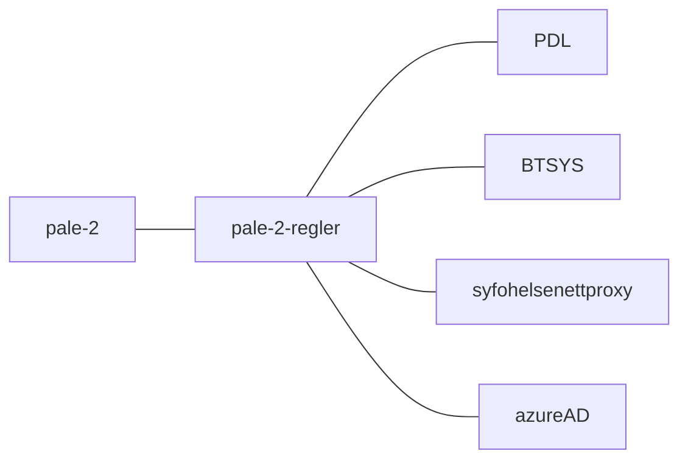
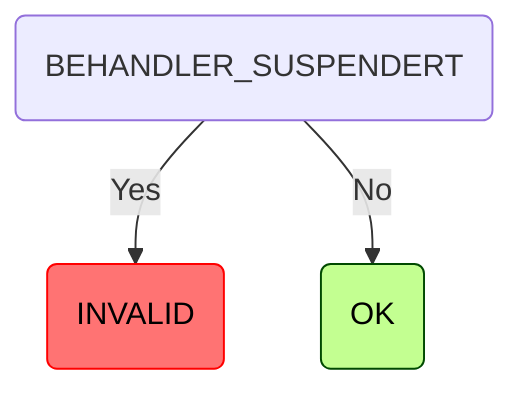
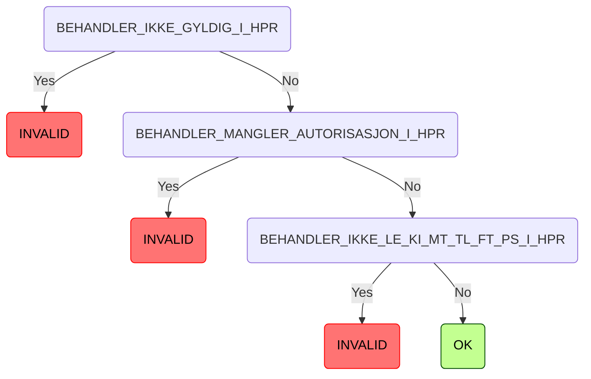
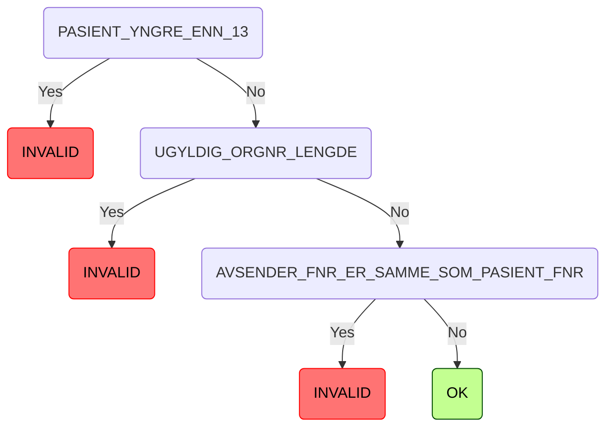

[](https://github.com/navikt/pale-2-regler/actions/workflows/deploy.yml)

# pale-2-regler
This project contains just the rules for validating legeerklæringer from pale-2 (https://github.com/navikt/pale-2)

## FlowChart
This the high level flow of the application


## Technologies used
* Kotlin
* Gradle
* Ktor
* Jackson
* Junit

#### Requirements

* JDK 17


#### Build and run tests
To build locally and run the integration tests you can simply run
``` bash
./gradlew shadowJar
```
or on windows 
`gradlew.bat shadowJar`

#### Creating a docker image
Creating a docker image should be as simple as `docker build -t pale-2-regler .`

#### Running a docker image
``` bash
docker run --rm -it -p 8080:8080 pale-2-regler
```

### Upgrading the gradle wrapper
Find the newest version of gradle here: https://gradle.org/releases/ Then run this command:

``` bash
./gradlew wrapper --gradle-version $gradleVersjon
```

<!-- RULE_MARKER_START -->
Lege suspensjon

HPR

Validation


<!-- RULE_MARKER_END -->

### Contact

This project is maintained by [navikt/teamsykmelding](CODEOWNERS)

Questions and/or feature requests? Please create an [issue](https://github.com/navikt/pale-2-regler/issues)

If you work in [@navikt](https://github.com/navikt) you can reach us at the Slack
channel [#team-sykmelding](https://nav-it.slack.com/archives/CMA3XV997)